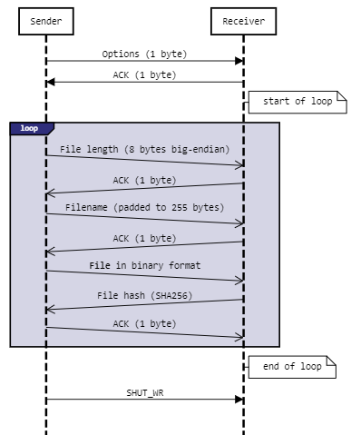

# Socket file transfer

A simple script for transferring files as binary data using stream (TCP) sockets.

## Usage example
##### Receiver:
```console
foo@bar:~$ python3 transfer.py recv
[*] Listening on: 0.0.0.0:35919
[*] Connection from: [127.0.0.1:55188]
my_file1.bin saved
my_file2.txt saved
foo@bar:~$ 
```
##### Sender:
```console
foo@bar:~$ python3 transfer.py send --rhost localhost 35919 --timeout -f my_file1.bin my_file2.txt
[*] Connected to: [127.0.0.1:35919]
sending: my_file1.bin ...
my_file1.bin SENT
sending: my_file2.txt ...
my_file2.txt SENT
foo@bar:~$ 
```

## Protocol

The predefined protocol is as follows:



## License

[MIT](https://choosealicense.com/licenses/mit/)